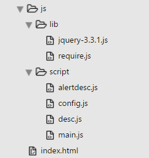

# requirejs-demo
>requirejs可以实现

1. 异步“加载”
2. 按需加载
3. 更加方便的模块依赖管理
4. 更加高效的版本管理

这里实现<b>按需请求</b>、<b>相关依赖</b>、把config 单独抽出来。

该demo的目录结构是

main.js是主程序代码
    
	require(['config'],function(){
	    require(['jquery'],function ($) {
	         $(document).on('click','#contentBtn',function(){
	            $('#messagebox').html('You have access Jquery by using require()');
	            require(['script/alertdesc'],function(alertdesc){
	                alertdesc();
	            });
	         });
	    });
	});

config.js是require配置代码

	define(function(){
	    require.config({
	        baseUrl: './js/',
	        paths: {
	            'jquery': 'lib/jquery-3.3.1'
	        }
	    });
	});

      
